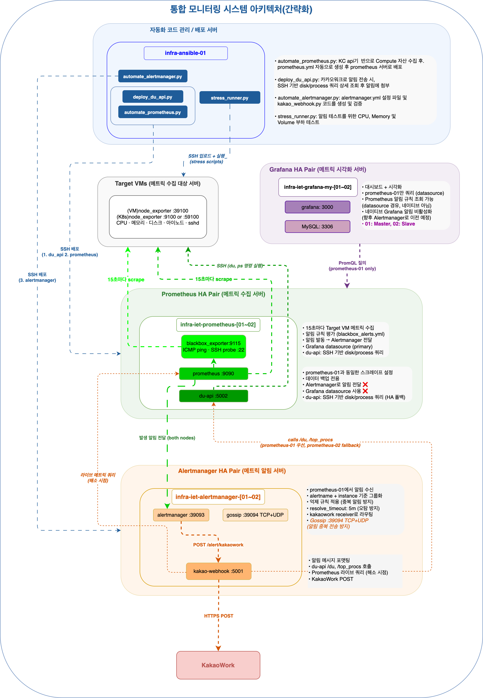
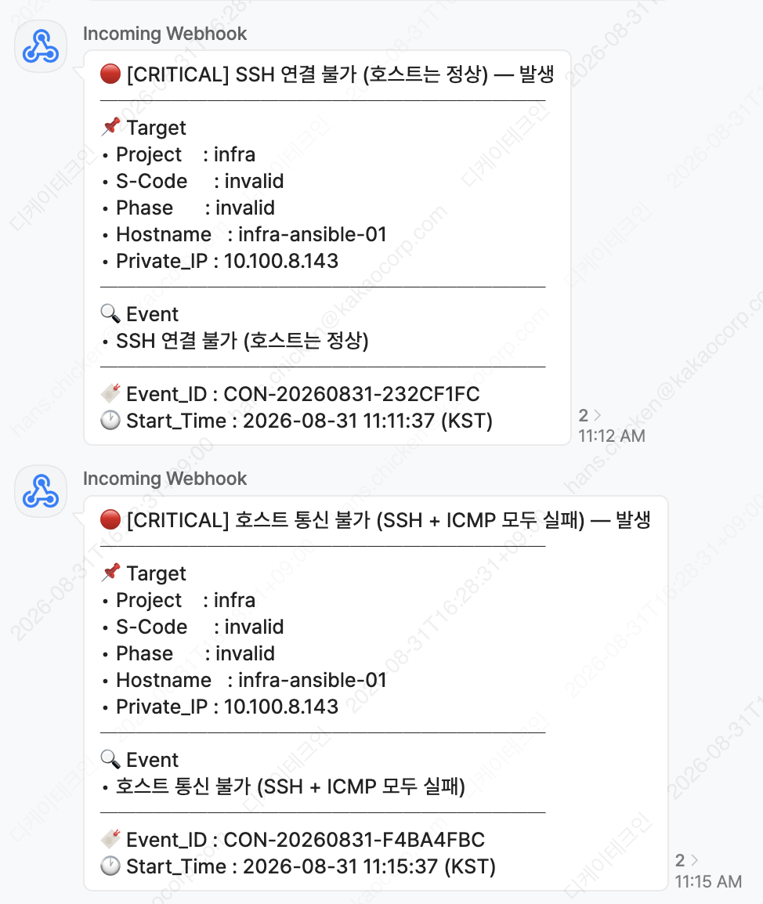
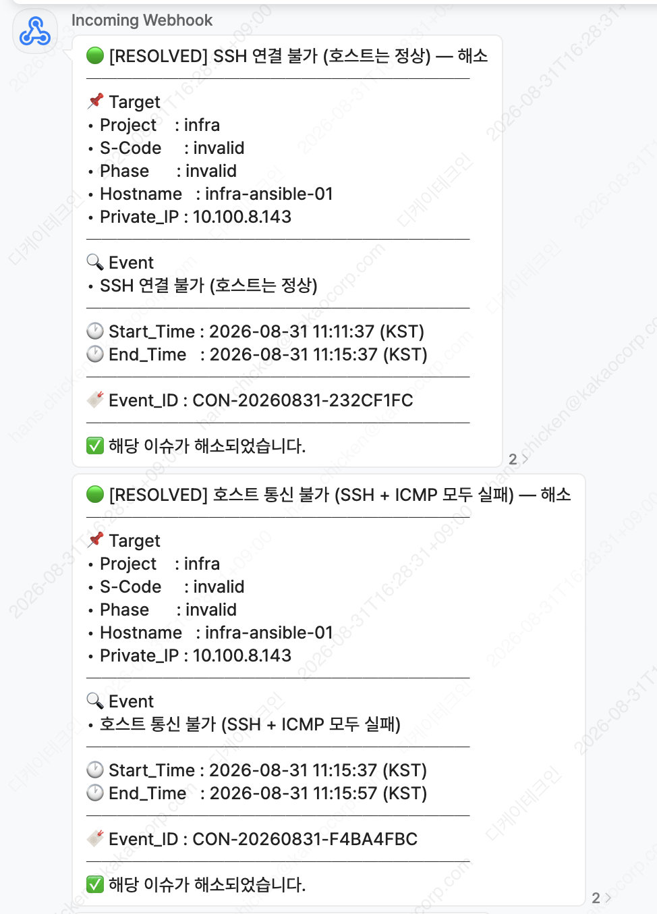
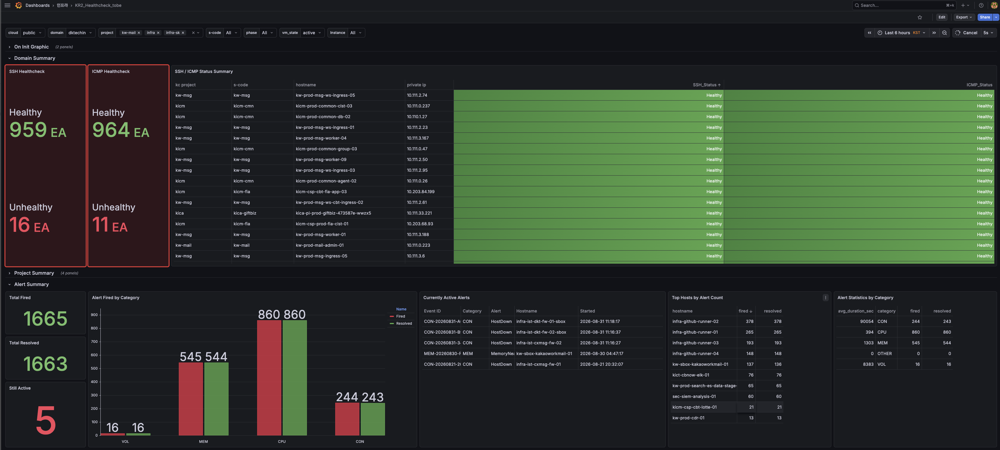
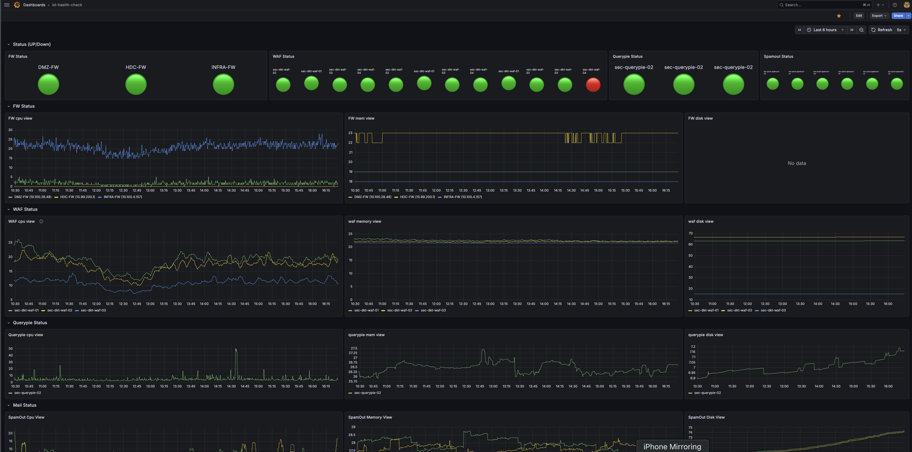

# Centralized Monitoring

> KakaoCloud에 배포된 **1,000개 이상의 VM**에 대해 메트릭 수집, 알림 규칙 평가, KakaoWork 알림 전송을 완전 자동화한 통합 모니터링 시스템.  
> 모든 설정과 배포는 단일 Ansible 서버에서 Python 스크립트로 관리. 프로덕션 서버를 직접 편집하지 않음.

---

## Overview

| 항목 | 내용 |
|---|---|
| **모니터링 대상** | KakaoCloud VM 1,000개+ (Ubuntu / Rocky Linux) |
| **알림 채널** | KakaoWork 봇 웹훅 |
| **핵심 스택** | Prometheus · Alertmanager · Blackbox Exporter · Node Exporter · FastAPI |
---

## Architecture



### 서버 구성

| 서버 | 역할 | 실행 서비스 |
|---|---|---|
| **infra-ansible-01** | 관리 / 배포 | 상시 서비스 없음 (배포 스크립트만 실행) |
| **prometheus-01** (Primary) | 메트릭 수집 + 규칙 평가 | prometheus :9090, du-api :5002, blackbox :9115 |
| **prometheus-02** (Backup) | 데이터 이중화 전용 | prometheus :9090, du-api :5002 |
| **alertmanager-01/02** (HA) | 알림 라우팅 + 웹훅 | alertmanager :39093, gossip :39094, kakao-webhook :5001 |
| **grafana-01/02** | 시각화 | grafana (prometheus-01만 datasource) |

### 전체 데이터 흐름

```
VM (node_exporter :39100)
        ↓  pull / 15초
Prometheus ──── 규칙 평가 (blackbox_alerts.yml)
        ↓  firing alert
Alertmanager-01 ◀──gossip──▶ Alertmanager-02
        ↓  POST localhost:5001
kakao-webhook (FastAPI)
    ├── disk alert  → du-api :5002 → SSH → du 명령
    ├── cpu/mem     → du-api :5002 → SSH → ps aux
    └── resolved    → Prometheus /api/v1/query (live)
        ↓
KakaoWork 채널
```

| 구간 | 설명 |
|---|---|
| VM → Prometheus | node_exporter 메트릭 15초 pull. blackbox_exporter가 Prometheus 호스트에서 ICMP/SSH 프로브 |
| Prometheus → Alertmanager | prometheus-01이 발동 알림을 alertmanager-01, 02 모두에 동시 전달 |
| Alertmanager HA Gossip | 두 노드가 :39094에서 Gossip 통신 — KakaoWork 중복 전송 방지 |
| kakao-webhook → du-api | 디스크: `/du` (top N dirs), CPU/메모리: `/top_procs` (top N procs) |
| du-api → Target VM | SSH로 대상 VM에 `du`, `ps aux` 직접 실행 |
| resolved | du-api 대신 Prometheus `/api/v1/query` 직접 쿼리 → 해소 시점 라이브 메트릭 조회 |

---

## Repository Structure

```
monitoring-automation/
├── prometheus/
│   └── tobe-automate-prometheus-scrape-config.py  # scrape target 자동화 + 알림 규칙 배포
├── alertmanager/
│   └── tobe-automate-alertmanager-with-webhook.py # Alertmanager + kakao-webhook 배포
├── dashboards/
│   ├── kr2-healthcheck.json                       # VM SSH/ICMP 연결성 대시보드
│   └── ist-health-check.json                      # FW/WAF/Querypie/메일 보안장비 대시보드
├── tools/
│   └── stress_runner.py                           # 원격 부하 테스트 오케스트레이터
├── docs/
│   ├── architecture_diagram.png                   # 아키텍처 다이어그램
│   ├── kr2_healthcheck.png                        # VM SSH/ICMP 대시보드 스크린샷
│   ├── fw_waf_healthcheck.png                     # 보안장비 대시보드 스크린샷
│   ├── alerting.png                               # KakaoWork 발생 알림 예시
│   └── resolved.png                               # KakaoWork 해소 알림 예시
└── README.md
```

---

## Scripts

### 1. `prometheus/tobe-automate-prometheus-scrape-config.py`

KakaoCloud API에서 전체 VM 목록을 조회하고 Prometheus scrape target과 알림 규칙을 자동 생성 및 배포.

**핵심 기능:**

- **KakaoCloud BCS API 페이지네이션** — 다수 프로젝트 토큰을 순회하며 전체 VM 목록 수집. Rate limit 발생 시 지수 백오프 재시도
- **배치 포트 체크** (`batch_check_ports`) — Prometheus 점프 호스트에서 `nc -z`를 병렬로 실행하는 원라이너 bash로 포트 도달성 일괄 확인. VM별 SSH 방식 대비 수분 → 수초로 단축
- **3종 타겟 파일 생성** — `targets_node_exporter.json`, `targets_blackbox_icmp.json`, `targets_blackbox_ssh.json`
- **VM 레이블 자동 부착** — project, phase, hostname, ipv4, type(vm/k8s), security_group, vm_state, total_volume_size
- **`promtool check rules` 검증** — 배포 전 규칙 파일 유효성 검증. 실패 시 배포 중단
- **신규 VM 자동 silence** — 기존 target과 비교해 새로 추가된 VM 감지 → Alertmanager에 5분 silence 자동 등록 (false positive 방지)
- **`OVERRIDE_TO_INVALID` 목록** — 모니터링 제외 호스트 명시적 관리
- **`HIGH_THRESHOLD_HOSTS`** — 고사용률 VM(메일 서버, NAS 등)에 대한 별도 디스크 임계치 규칙
- **Prometheus 어노테이션 템플릿** — 알림 메시지에 live 메트릭 인라인 포함 (used%, avail, total 등)

```python
# 핵심 로직: 수백 개 포트를 SSH 1회 세션으로 병렬 체크
parts = [
    f'(nc -z -w2 {ip} {port} && echo "OK {ip} {port}" || echo "FAIL {ip} {port}") &'
    for ip, port in targets
]
cmd = ' '.join(parts) + ' wait'
```

**알림 규칙 전체 목록:**

| 알림명 | 조건 | for | severity |
|---|---|---|---|
| `SSHDServiceDown` | sshd.service 비활성 | 30s | critical |
| `SSHDown` | SSH 실패 + ICMP 정상 | 0s | critical |
| `HostDown` | SSH + ICMP 모두 실패 | 0s | critical |
| `SSHDownCausedByOOM` | SSH 실패 + 10분 내 OOM kill | 0m | critical |
| `CPUCritical` | CPU > 95% (2분 평균) | 2m | critical |
| `MemoryCritical` | 메모리 사용 > 95% | 1m | critical |
| `MemoryNearExhaustion` | 메모리 사용 > 90% | 2m | warning |
| `DiskSpaceWarning` | 디스크 > 90% | 1m | warning |
| `DiskSpaceCritical` | 디스크 > 95% | 30s | critical |
| `DiskSpaceImminent` | 디스크 > 99% | 30s | imminent |
| `InodeWarning` | Inode > 80% | 1m | warning |
| `InodeCritical` | Inode > 90% | 30s | critical |

---

### 2. `alertmanager/tobe-automate-alertmanager-with-webhook.py`

Alertmanager 설정과 KakaoWork 웹훅 서버를 코드로 관리하고 자동 배포.

**구조:**
- `alertmanager.yml` — 라우팅, 억제 규칙, repeat_interval이 문자열로 임베드
- `kakao_webhook.py` — FastAPI 웹훅 서버 코드가 문자열로 임베드
- 배포 시 `amtool check-config` 검증 → SFTP 전송 → 서비스 재시작

**Alertmanager 억제 규칙 (inhibit_rules):**

| 소스 알림 | 억제 대상 | 기준 |
|---|---|---|
| `HostDown` | `SSHDown` | instance |
| `SSHDownCausedByOOM` | `SSHDown` | instance |
| `MemoryCritical` | `MemoryNearExhaustion` | instance |
| `DiskSpaceImminent` | `DiskSpaceCritical` + `DiskSpaceWarning` | instance + mountpoint |
| `DiskSpaceCritical` | `DiskSpaceWarning` | instance + mountpoint |
| `InodeCritical` | `InodeWarning` | instance + mountpoint |

**KakaoWork 웹훅 서버 (`kakao_webhook.py`) 주요 기능:**

- **개별 알림 (≤ 3건)** — 알림 유형별 구조화된 메시지 생성
  - 디스크: `du-api /du` → 상위 3개 디렉토리/파일 + 사용량
  - CPU: `du-api /top_procs` → 상위 3개 프로세스 + 코어 수
  - 메모리: `du-api /top_procs` → 상위 3개 프로세스 + 사용 메모리
  - 해소: Prometheus `/api/v1/query`로 현재 메트릭 직접 조회
- **대규모 장애 (> 3건)** — 알림명별 그룹화, VM 목록(최대 10개 + overflow)
- **부분/완전 복구 추적** — `outage_tracker.json`으로 재시작 후에도 전체/해소 카운트 유지
- **알림 통계 API** — 이벤트 로그 기반 (카운터 드리프트 방지)

**통계 API 엔드포인트:**

```
GET  /stats/summary       # 전체 fired/resolved/still_active
GET  /stats/by_category   # VOL/MEM/CPU/CON 카테고리별 집계
GET  /stats/active        # 현재 미해소 알림 목록 (날짜 필터 지원)
GET  /stats/events        # 이벤트 로그 조회 (카테고리/알림명/호스트/날짜 필터)
GET  /stats?category=VOL  # 카테고리별 상세 (top hosts, avg duration)
POST /stats/reset         # 통계 초기화
GET  /healthz             # 서비스 상태 확인
```

**KakaoWork 알림 메시지 포맷:**

알림 발생 시 심각도별 이모지(🔴 critical / 🟡 warning / ⚫ imminent)와 함께 Target 정보, 리소스 상세, Event_ID가 구조화된 메시지로 전송됨. 해소 시에는 🟢 [RESOLVED]로 Start/End Time과 함께 전달됨.

| 발생 알림 | 해소 알림 |
|---|---|
|  |  |

---

### 3. `tools/stress_runner.py`

알림 파이프라인 검증용 원격 부하 테스트 오케스트레이터.

**동작 방식:**
1. SSH로 대상 VM에 접속해 코어 수 자동 감지 (`nproc`)
2. CPU/메모리/디스크 스트레스 스크립트를 `/tmp/.stress_runner/`에 SFTP 업로드
3. 지정한 스트레서를 SSH 병렬 실행, 출력 스트리밍
4. Ctrl+C 또는 완료 시 원격 프로세스 종료 + 파일 자동 정리

```bash
# CPU 단독 테스트 (96%, 180초)
sudo python3 stress_runner.py --host <vm-hostname> --only cpu --cpu-percent 96 --duration 180

# 메모리 단독 테스트
sudo python3 stress_runner.py --host <vm-hostname> --only mem --mem-percent 96 --duration 180

# 디스크 단독 테스트
sudo python3 stress_runner.py --host <vm-hostname> --only vol --vol-percent 92 --duration 180

# CPU + 메모리 + 디스크 통합 테스트
sudo python3 stress_runner.py --host <vm-hostname> --cpu-percent 100 --mem-percent 96 --vol-percent 92 --duration 180
```

**예상 알림 발동 시간:**

| 알림 | 조건 | 예상 발동 |
|---|---|---|
| `CPUCritical` | CPU > 95% | 부하 시작 후 약 30초 |
| `MemoryCritical` | 메모리 > 95% | 부하 시작 후 약 1분 |
| `DiskSpaceWarning` | 디스크 > 90% | 부하 시작 후 약 1분 |
| `DiskSpaceCritical` | 디스크 > 95% | 부하 시작 후 약 1.5분 |

---

## Deployment

### 배포 순서 (최초)

| 순서 | 스크립트 | 수행 내용 |
|---|---|---|
| 1 | `deploy_du_api.py` | du_api.py 임베드 → Prometheus 호스트 SFTP 배포 → 서비스 재시작 → `/healthz` 확인 |
| 2 | `tobe-automate-prometheus-scrape-config.py` | KakaoCloud API 조회 → 배치 포트 체크 → 타겟 JSON 3종 생성 → `promtool` 검증 → 배포 + `/-/reload` |
| 3 | `tobe-automate-alertmanager-with-webhook.py` | alertmanager.yml + kakao_webhook.py 생성 → `amtool` 검증 → 배포 → 서비스 재시작 |

> ⚠️ **순서 중요**: du-api가 먼저 실행되어야 kakao-webhook이 정상 작동하고, Prometheus 규칙이 로드되어야 알림이 발동.

### 부분 배포 (변경 시)

| 변경 사항 | 실행 스크립트 |
|---|---|
| VM 추가/제거 | `tobe-automate-prometheus-scrape-config.py` |
| 알림 규칙 임계값 변경 | `tobe-automate-prometheus-scrape-config.py` |
| KakaoWork 메시지 포맷 변경 | `tobe-automate-alertmanager-with-webhook.py` |
| Alertmanager 라우팅/억제 규칙 | `tobe-automate-alertmanager-with-webhook.py` |
| `HIGH_THRESHOLD_HOSTS` 호스트 추가 | `tobe-automate-prometheus-scrape-config.py` |

### 알림 재전송 Interval

| 알림 | repeat_interval |
|---|---|
| SSHDown, HostDown, SSHDServiceDown | 12시간 |
| CPUCritical, MemoryCritical, MemoryNearExhaustion | 30분 |
| DiskSpaceCritical, DiskSpaceImminent, InodeCritical | 30분 |
| DiskSpaceWarning, InodeWarning | 1시간 |

### 알림 통계 초기화

```bash
curl -X POST 'http://alertmanager-01.internal.example.com:5001/stats/reset'
curl -X POST 'http://alertmanager-02.internal.example.com:5001/stats/reset'
```

---

## Grafana Dashboards

모니터링 시스템의 시각화 레이어. 두 가지 대시보드로 VM 연결성과 보안 장비 상태를 통합 관리.

### 1. VM SSH/ICMP Health Check (`dashboards/kr2-healthcheck.json`)



1,000개+ VM의 SSH/ICMP 연결 상태를 실시간으로 시각화하고 알림 통계를 통합 표시.

| 섹션 | 내용 |
|---|---|
| **On Init Graphic** | JS pulse 애니메이션 — SSH Unhealthy > 12대 또는 ICMP Unhealthy > 8대 시 패널 테두리가 빨간색으로 pulse |
| **Domain Summary** | SSH/ICMP Healthy·Unhealthy 카운트 + 전체 VM 상태 테이블 (project·s-code·hostname·IP·상태) |
| **Project Summary** | 프로젝트별 SSH/ICMP 상세 현황 |
| **Alert Summary** | Total Fired/Resolved/Active · 카테고리별 Bar chart · 현재 활성 알림 · Top Hosts · 평균 지속시간 |

**기술적 포인트:**
- `gapit-htmlgraphics-panel` — `window.parent`로 Grafana DOM에 직접 CSS 주입해 실시간 상태 시각화
- Dual Datasource — Prometheus(메트릭) + Infinity Plugin(kakao-webhook `/stats/*` REST API 직접 호출)
- 5초 Grafana 자동 새로고침 + 3초 JS polling 이중 구조

```promql
# SSH Unhealthy 카운트
count(probe_success{job="blackbox_ssh", vm_state="active"} == 0)

# 전체 VM SSH/ICMP 상태 테이블
probe_success{job="blackbox_ssh", domain=~"$domain", vm_state="active"}
```

---

### 2. Security Infrastructure Health Check (`dashboards/ist-health-check.json`)



Fortigate 방화벽(SNMP), WAF, Querypie(DB 접근제어), 메일 보안 장비를 단일 대시보드로 통합 모니터링.

| 섹션 | 모니터링 대상 | 메트릭 소스 |
|---|---|---|
| **FW Status** | Fortigate 3대 (INFRA-FW / DMZ-FW / HDC-FW) | SNMP Exporter (`fg_cpu_usage`, `fg_memory_usage`, `fgSysDiskUsage`) |
| **WAF Status** | WAF 4대 | Node Exporter (`node_cpu_seconds_total`, `node_memory_*`, `node_filesystem_*`) |
| **Querypie Status** | Querypie 2대 (DB 접근제어) | Node Exporter |
| **Mail Status** | SpamOut 2대 + SpamSniper 2대 | Node Exporter |

**기술적 포인트:**
- Fortigate는 SNMP Exporter 전용 메트릭(`fg_*`) 사용 — VM과 다른 수집 경로
- `label_replace()`로 IP → 장비 alias 변환 (가독성 향상)
- 5초 자동 새로고침, 전 장비 UP/Down 🟢🔴 상태를 최상단에 한눈에 표시

```promql
# Fortigate CPU (SNMP Exporter)
fg_cpu_usage{instance=~"<INFRA_FW_IP>|<DMZ_FW_IP>|<HDC_FW_IP>"}

# IP → Alias 변환
label_replace(..., "alias", "INFRA-FW", "instance", "<INFRA_FW_IP>")

# WAF CPU (Node Exporter)
100 - (avg by (hostname)(rate(node_cpu_seconds_total{mode="idle", hostname="waf-01..."}[5m])) * 100)
```

---

## Credentials

자격증명은 `/etc/mgt-api/` 경로의 파일에서 로드하며 코드에 하드코딩하지 않음.

```
/etc/mgt-api/.tokens          # KakaoCloud API 토큰 (프로젝트별)
/etc/mgt-api/.ssh_credentials # SSH 접속 계정 정보
/etc/mgt-api/.project_id      # 프로젝트 ID ↔ 이름 매핑
```

---

## Tech Stack

- **Python 3** — 전체 자동화 스크립트
- **Prometheus** — 메트릭 수집 및 알림 규칙 평가
- **Alertmanager** — 알림 라우팅, 억제, HA
- **Blackbox Exporter** — ICMP / SSH 연결성 프로브
- **Node Exporter** — 호스트 메트릭 (CPU, 메모리, 디스크, Inode)
- **FastAPI + uvicorn** — kakao-webhook, du-api
- **Paramiko** — SSH/SFTP 자동화
- **KakaoWork** — 알림 수신 채널
- **KakaoCloud** — 인프라 환경
